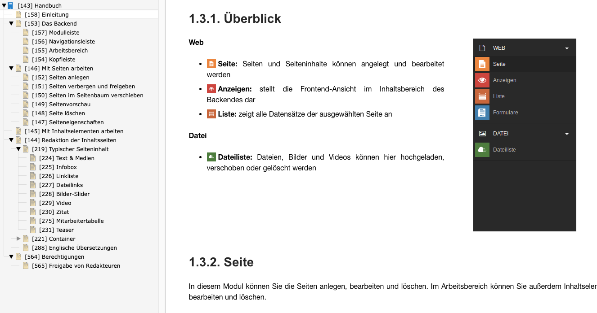

<div align="center">


# TYPO3 extension `xima_typo3_manual`

[](https://extensions.typo3.org/extension/xima_typo3_manual)

</div>

This extension is a sitepackage, designed for the creation of user manuals.
Administrators can easily create chapters by adding TYPO3 page records with a
special doktype.



## Features

* Backend module with preview
* Associate individual chapters to TYPO3 records for easy access
* Directly open the chapter in modal while editing the record
* PDF download
* Annotate screenshots with image editor:
  See [bw_focuspoint_images](https://extensions.typo3.org/extension/bw_focuspoint_images)
* TYPO3 system icons available in RTE:
  See [bw_icons](https://extensions.typo3.org/extension/bw_icons)

## Requirements

* TYPO3 12.4 & PHP 8.1+

## Installation

### Composer

```bash
composer require xima/xima-typo3-manual
```

### TER

[](https://extensions.typo3.org/extension/xima_typo3_manual)

Download the zip file from
[TYPO3 extension repository (TER)](https://extensions.typo3.org/extension/xima_typo3_manual).

## Configuration

It's like configuring a sitepackage.

* Start with creating a new page in the page tree
* Select Type "**Manual page**"
* Check "**Use as Root Page**"
* Include **static PageTS** "XIMA Manual"
* Create new **Root-TypoScript** template for this page and include static
  TypoScript of this extension

## License

This project is licensed
under [GNU General Public License 2.0 (or later)](LICENSE.md).
