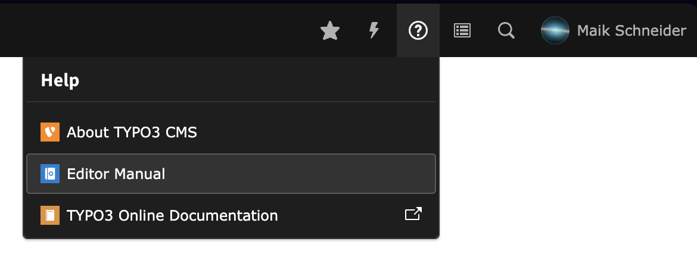
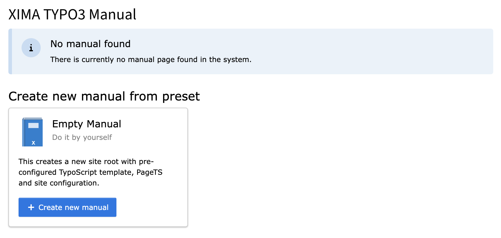
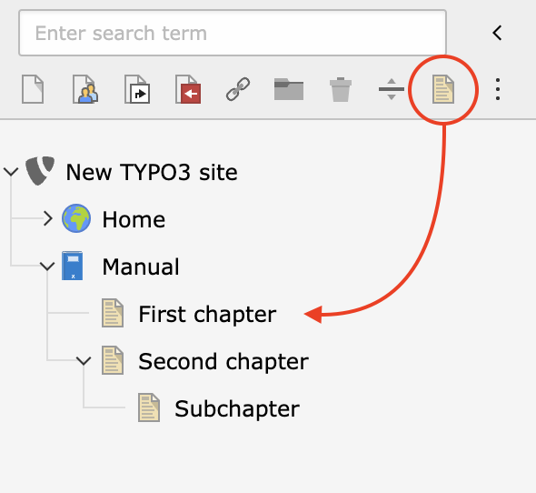
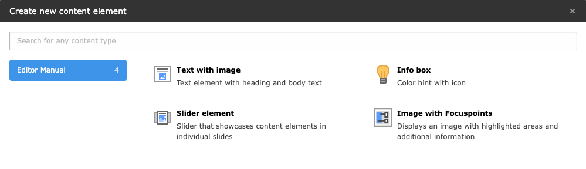
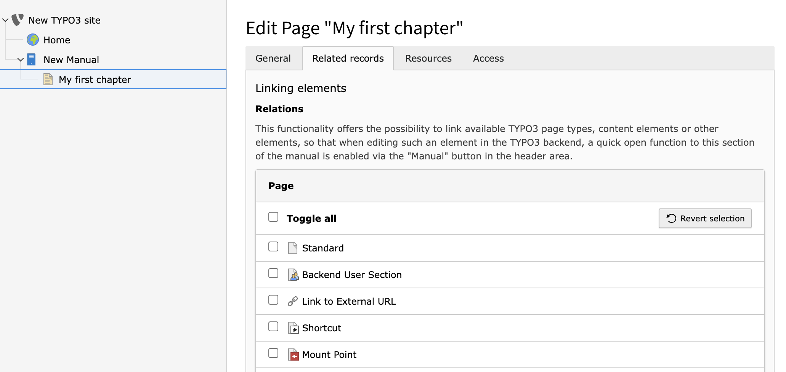
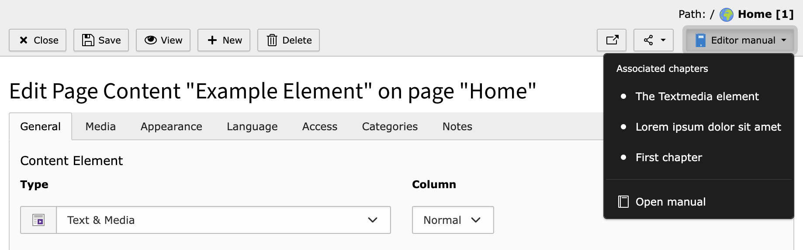

<div align="center">


# TYPO3 extension `xima_typo3_manual`


[](https://extensions.typo3.org/extension/xima_typo3_manual)

[](https://packagist.org/packages/xima/xima-typo3-manual)

</div>

This extension is a sitepackage, designed for the creation of user manuals.
Administrators can easily create chapters by adding TYPO3 page records with a
special doktype.


## Features

* Backend module with preview
* Associate individual chapters to TYPO3 records for easy access
* Directly open chapters in a modal while editing records
* PDF download
* Annotate screenshots with image editor:
See [bw_focuspoint_images](https://extensions.typo3.org/extension/bw_focuspoint_images)
* TYPO3 system icons available in RTE:
See [bw_icons](https://extensions.typo3.org/extension/bw_icons)

## Requirements

* TYPO3 12.4 & PHP 8.1+

## Installation

### Composer

```bash
composer require xima/xima-typo3-manual
```

### TER

[](https://extensions.typo3.org/extension/xima_typo3_manual)

Download the zip file from
[TYPO3 extension repository (TER)](https://extensions.typo3.org/extension/xima_typo3_manual).

## Configuration

This extension works like a sitepackege. You can configure it manually or use
the installation wizard to create from a preset.

### From Preset

When opening the Manual modal the first time, you will be asked to create a new
manual from a preset. This will create a new page tree with the necessary
configuration:




### Manual Configuration

* Start with creating a new page in the page tree
* Select Type "**Manual page**"
* Check "**Use as Root Page**"
* Include **static PageTS** "XIMA Manual"
* Create new **Root-TypoScript** template for this page and include static
TypoScript of this extension

## Usage

### Create a new chapter

Create chapters by adding new pages with the doktype "**Manual page**":



Add content elements to the pages to fill the chapters:



### Link chapters to records

You can link chapters to records by selecting the record types in the **Related
records**
tab of manual pages and text elements:



If manual elements are found while editing a record, a dropdown button will
appear in the doc header. These links are opened in a modal:



## Customization

* Link color and logo: Values of the backend are
used: ```$GLOBALS['EXTENSIONS']['backend']```
* Manual title: The `websiteTitle` of the generated site configuration is used

## Contribute

You want to customize more? Open an issue or create a pull request!

Please have a look at [`CONTRIBUTING.md`](CONTRIBUTING.md).

## License

This project is licensed
under [GNU General Public License 2.0 (or later)](LICENSE.md).
