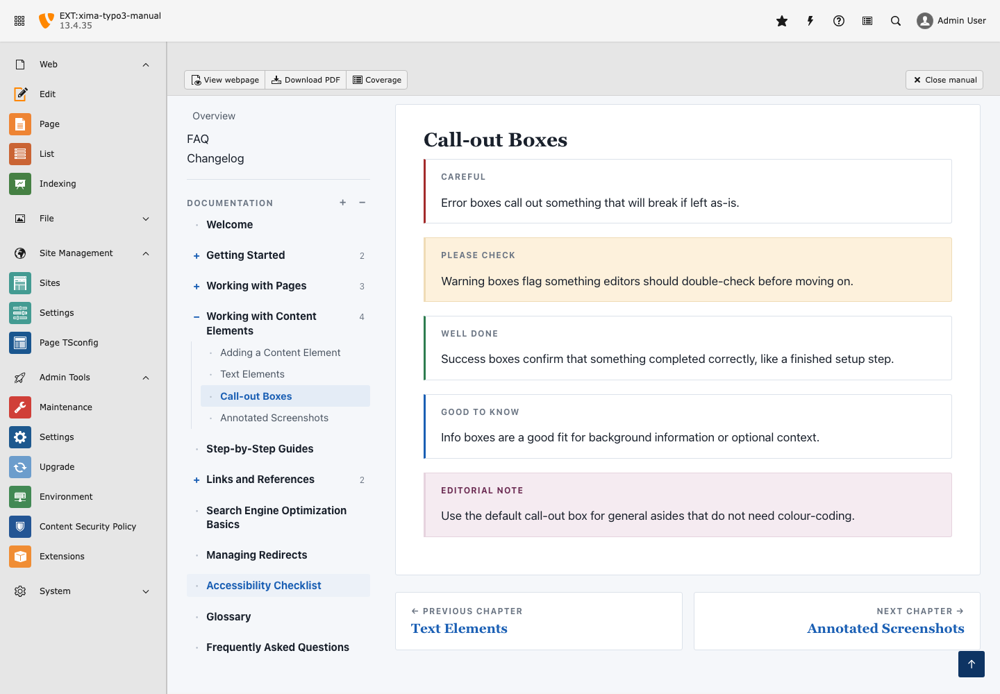
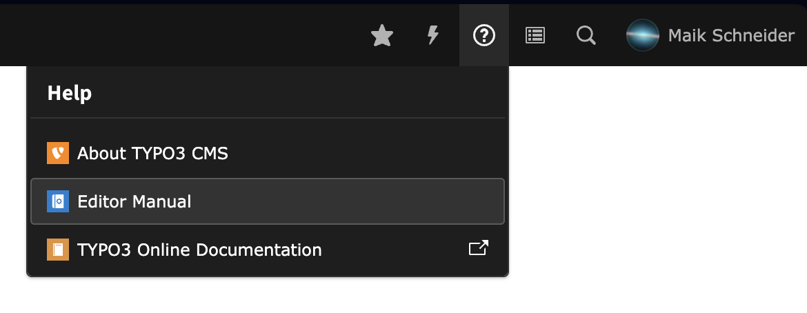
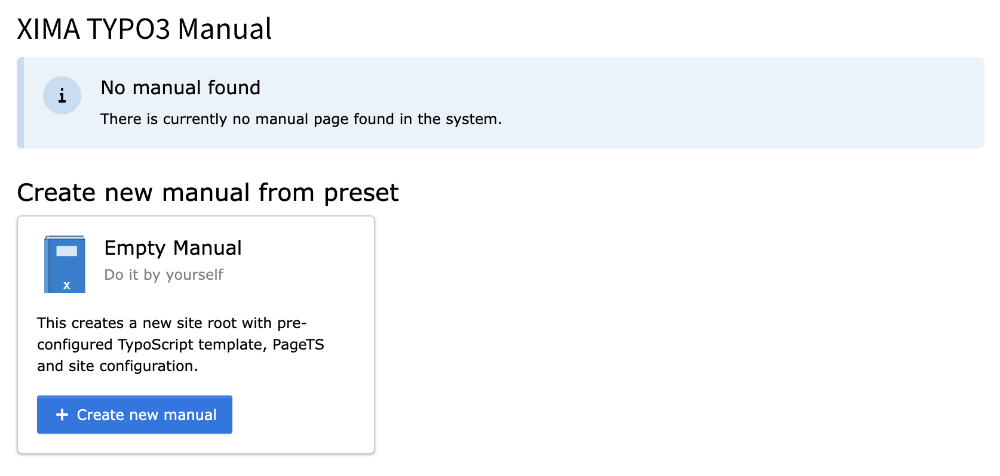
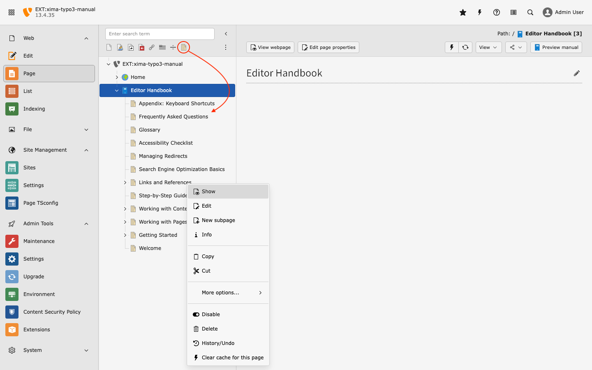
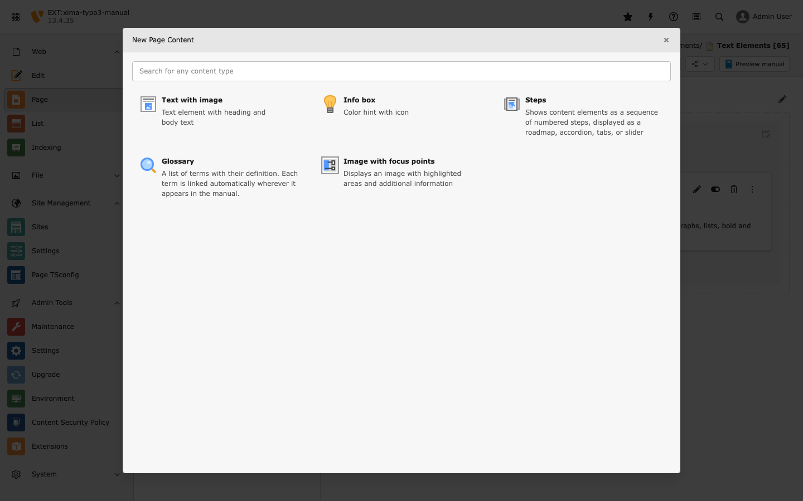
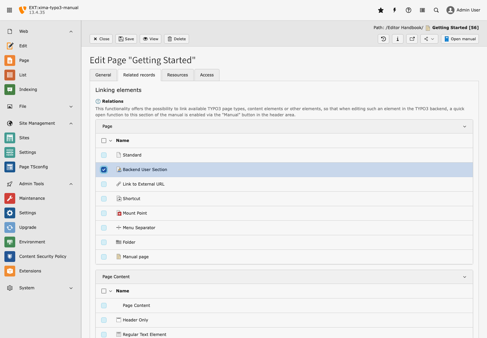
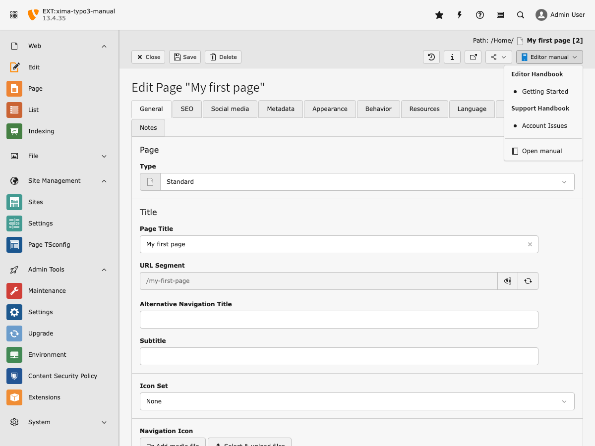

<div align="center">


# TYPO3 extension `xima_typo3_manual`


[](https://extensions.typo3.org/extension/xima_typo3_manual)

[](https://packagist.org/packages/xima/xima-typo3-manual)

</div>

This extension is a sitepackage, designed for the creation of user manuals.
Administrators can easily create chapters by adding TYPO3 page records with a
special doktype.



## Features

* Backend module with preview
* Its own design system: serif headings, a calm blue lead colour and self-hosted fonts
* Full text search over the whole manual
* Glossary elements: terms are linked and explained automatically wherever they appear
* Documentation coverage report: which record types are documented, and which are not
* Several manuals side by side, for example one per editor role or per website
* Associate individual chapters to TYPO3 records for easy access
* Directly open chapters in a modal while editing records
* PDF download
* Annotate screenshots with image editor:
See [bw_focuspoint_images](https://extensions.typo3.org/extension/bw_focuspoint_images)
* TYPO3 system icons available in RTE:
See [bw_icons](https://extensions.typo3.org/extension/bw_icons)

## Compatibility

| TYPO3      | PHP         | Extension |
|------------|-------------|-----------|
| 14.3 LTS   | 8.2 – 8.5   | 2.1+      |
| 13.4 LTS   | 8.2 – 8.4   | 2.1+      |
| 12.4 LTS   | 8.1 – 8.3   | 2.0.x     |

## Installation

### Composer

```bash
composer require xima/xima-typo3-manual
```

### TER

[](https://extensions.typo3.org/extension/xima_typo3_manual)

Download the zip file from
[TYPO3 extension repository (TER)](https://extensions.typo3.org/extension/xima_typo3_manual).

## Configuration

This extension works like a sitepackege. You can configure it manually or use
the installation wizard to create from a preset.

### From Preset

When opening the Manual modal the first time, you will be asked to create a new
manual from a preset. This will create a new page tree with the necessary
configuration:




### Manual Configuration

* Start with creating a new page in the page tree
* Select Type "**Manual page**"
* Check "**Use as Root Page**"
* Create a site configuration for that page and add the site set "**XIMA Manual**"
(`xima/manual`) under *Dependencies*

Installations that predate site sets can keep the previous wiring instead: include
the **static PageTS** "XIMA Manual" and create a root TypoScript template that
includes the static TypoScript of this extension.

## Visual editing

With [`friendsoftypo3/visual-editor`](https://github.com/FriendsOfTYPO3/visual_editor)
installed, chapter headings and texts can be edited inline in the backend module
*Web > Edit*, in the layout the reader sees:

```bash
composer require friendsoftypo3/visual-editor
```

Nothing else has to be configured. The extension is optional; without it the
manual renders exactly as before.

One limitation is worth knowing: a manual renders its whole page tree on a single
page, while the visual editor takes the page that new elements are added to from
the request. Adding, moving and deleting elements therefore works in the chapter
that is the requested page — open `Web > Edit` on that chapter to edit its
structure. Editing existing headings and texts works in every chapter.

## Several manuals

An installation can hold any number of manuals: create one manual page tree per
manual, each with its own site configuration. The backend module then shows a
manual selector in its doc header, remembers which manual you read last, and the
manual button of every other module groups the chapters it found by the manual
they belong to. Manuals a backend user has no page permissions for are hidden
from both.

## Usage

### Create a new chapter

Create chapters by adding new pages with the doktype "**Manual page**":



Add content elements to the pages to fill the chapters:



### Link chapters to records

You can link chapters to records by selecting the record types in the **Related
records**
tab of manual pages and text elements:



If manual elements are found while editing a record, a dropdown button will
appear in the doc header. These links are opened in a modal:



## Customization

The site set `xima/manual` brings its settings along, so they can be edited per
site under *Site Management > Sites > Settings*:

| Setting | Default | Effect |
|---|---|---|
| `manual.appearance.primaryColor` | `#1A5FB4` | Lead colour: links, markers, active states |
| `manual.appearance.showNavigation` | enabled | Shows the chapter navigation sidebar. Turn it off to hide it entirely |
| `manual.appearance.showToc` | enabled | Shows the "Contents" / "On this page" column. Turn it off to hide it entirely |
| `manual.appearance.showContentInNavigation` | disabled | Lists content-element headers in the navigation tree too, not just chapter pages — how navigation worked before it became chapter-only. Combine with `showToc` off for that original look |
| `manual.behaviour.displayFullManual` | enabled | Renders every chapter on one page. Turn it off to show one chapter per page, with the chapter list linking to the pages instead of anchors |

* Logo: the `media` field of the manual root page, falling back to the backend
login logo
* Manual title: the `websiteTitle` of the site configuration is used

## Development

Everything runs inside DDEV:

```bash
ddev start
ddev init-typo3          # empty database, fixtures and site configuration
ddev composer sca        # composer normalize, php-cs-fixer, PHPStan, rector, linters
ddev exec vendor/bin/phpunit -c phpunit.xml.dist
ddev playwright test     # acceptance tests, needs the ddev playwright add-on
```

To try the extension against the other supported TYPO3 version, put a second
install next to this one instead of switching versions in place:

```bash
git worktree add ../xima-typo3-manual-v13
printf 'name: xima-typo3-manual-v13\n' > ../xima-typo3-manual-v13/.ddev/config.local.yaml
cd ../xima-typo3-manual-v13 && ddev start
ddev composer update --with "typo3/cms-core:^13.4" --with "typo3/cms-rte-ckeditor:^13.4"
ddev init-typo3
```

## Contribute

You want to customize more? Open an issue or create a pull request!

Please have a look at [`CONTRIBUTING.md`](CONTRIBUTING.md).

## License

This project is licensed
under [GNU General Public License 2.0 (or later)](LICENSE.md).
